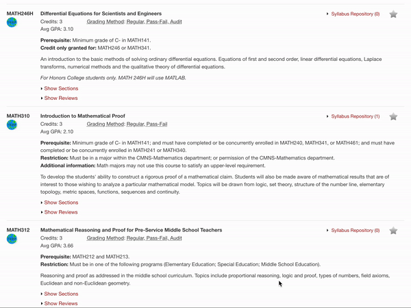
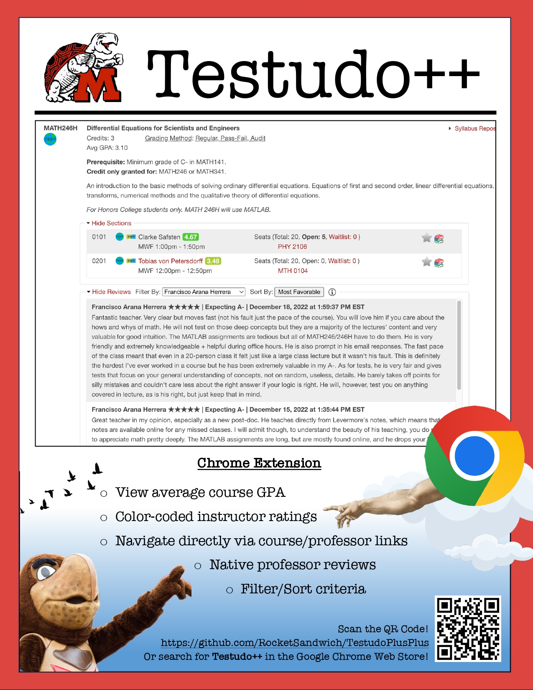

# Testudo++
A streamlined process for reviewing course details and professor evaluations integrated as a browser extension on https://app.testudo.umd.edu/soc/ using the PlanetTerp API. 

Download *Testudo++* as a Chrome Extension [here](https://chromewebstore.google.com/detail/testudo++/fgjllkiccpfacobekfcnldelggcgnnic).  
Or search for it in the Google Chrome Web Store!

## Table of Contents
- [Previews](#Previews)
- [Features](#Features)
- [Skills and Technologies](#Skills-and-Technologies)
- [Status](#Status)
- [Contribute](#Contribute)
- [Meta](#Meta)
- [Reflection](#Reflection)

## Previews
### Demonstration

### Poster Advertisement

I should've been a graphic design major b/c this poster is just too cool tbh.  
It's supposed to be a reference to Michelangelo's [The Creation of Adam](https://en.wikipedia.org/wiki/The_Creation_of_Adam).

## Features
- Displays average course GPA
- Course link navigates you to the corresponding PlanetTerp course website
- Professor links
    - PlanetTerp link navigates you to the corresponding PlanetTerp professor page
    - RateMyProfessor link navigates you to the corresponding RateMyProfessor professor page
- Professor ratings show the average student ratings given to that professor
    - Intuitive matching color gradient to indicate positive/negative scale (green, yellow, red)
- Scrollable professor reviews window
    - Able to filter by professor
        - Organized by active/inactive instructor status
        - View by grouping
        - Sorted alphabetically 
    - Able to sort by 'Most Recent', 'Most Critical', and 'Most Favorable'
    - Additional information popup window

## Skills and Technologies
- Javascript, HTML, CSS
- Asynchronous Handling
- Cross-Origin Resource Sharing (CORS) compliance, limitations, & significance
- Service Workers
- Mutation Observer API
- AJAX Fetch API
- [Chrome Extension API](https://developer.chrome.com/docs/extensions/reference/api)
- [PlanetTerp API](https://planetterp.com/api/)

## Status
Just finished the initial release (1.0.0).  I might take a break from this for a bit since the base feature set is developed enough, but there is still more that I've thought to add/fix.
### Future Implementations
- Display the total student count next to the 'Avg GPA'
    - This would help provide extra context to the 'Avg GPA' value by showing the sample size
    - It should be relatively easily to implement given the PT API grades request, although it would be a bit time-consuming
    - Worried about minimizing API calls since course-page lists can extend pretty long (avoid rate limiting)
- Make reviews window size manually re-adjustable  
    - Corner tab to vertically-drag and expand/shrink container
- Design functional extension icon popup window
    - Can manually toggle links, reviews, layout, etc. for customization
- Significantly refactor codebase
    - I definitely know that large improvements could be made in the way it's coded and organized
- Fix random instances of "Extension context invalidated" Error Message
    - "Extension is unloaded, the existing content scripts lose their connection to the rest of the extension—i.e. ports close, and they would be unable to use runtime.sendMessage()—but the content scripts themselves still continue to work, as they're already injected into their pages... Problems can arise if either: (1) your original content script is still trying to communicate with the rest of the extension or (2) your original content script does things like modify the DOM, as you could end up with those changes done more than once."
    - An informative thread: https://stackoverflow.com/questions/53939205/how-to-avoid-extension-context-invalidated-errors-when-messaging-after-an-exte
- Potentially integrate with some other public testudo extensions
    - Schedule Importer, etc.
- Migrate extension to support other browsers (Safari, firefox, etc.)
- Add support for different screen dimensions (mobile phone & tablet)
- *Find way to alleviate maintainence hour access
    - Just an idea: Fetch local copies of transcript, schedule, etc., and use [chrome.storage](https://developer.chrome.com/docs/extensions/reference/api/storage) as "snapshots" since last updated

## Contribute
Pull requests are the best way to propose changes to the codebase. I actively welcome your pull requests:

1. Fork the repo and create your own feature branch from main.
2. Commit your code changes.
3. Push to your feature branch.
6. Issue a pull request!

Distributed under the MIT license. See ``LICENSE`` for more information.

## Meta
Timeline: (December 20th, 2023 - February 1st, 2024)  
Made by Joshua Nguyen: UMDcs'25
- [LinkedIn](https://www.linkedin.com/in/joshua-nguyen-666837241/)
- nguyen.trong.joshua@gmail.com

## Reflection
### Introduction
This entire project was a rollercoaster. I had this idea during a trip in Vietnam over winter break, and I began to officially work on it after returning to the States. Initially, I planned on calling it "Testudo Reviews"; however, I eventually changed it to "Testudo++" after realizing that I wanted the scope of the project expand. This was officially my first front-end project, and I definitely fumbled my way around the javascript and CSS.  Thankfully however, the manifest file was easy to understand as well as the communication between background and content scripts.  Most of my time was spent processing data responses and injecting elements into the DOM via the content script, so it wasn't bad (actually quite fun).  I was able to learn so many cool things such as how to implement the smooth, expanding drop-down box transitions and modal pop-ups using tags and attributes I had no idea existed.

### Challenges & Solutions
#### Minimizing API calls
One of my biggest concerns with utilizing PlanetTerp data was trying my best to optimize requests based on necessity.  The last thing I wanted to do was overload their servers (hit a rate limit) given that there could be *lots* of courses listed per page as well as *lots* of professors multiplied by each course's section. I knew that there were some redundancies within the page, so I was able to minimize the calls to request only *new* data by storing relevant values in a global data structure.  So, if Course B had the same exact professors as Course A, then it wouldn't fetch any data and simply pull from the global data structure.

#### Request Count vs Size Tradeoffs
Another concern regarding data fetching was debating whether I should have a single request for a large chunk of data vs many requests for much smaller, individual pieces of data. I initially thought about loading a significant amount up-front so that the user wouldn't have to worry about making more requests later on - intrducing more network dependency -; however, I opted for the smaller, discrete approach for a couple of reasons. First, the PT API did not allow me to make large targeted requests, meaning that I would inevitably be requesting more data than what was necessary. Second, by delaying the fetch calls to strictly when the user needs them, it helps tackle the prior challenge by further minimizing the total API requests.  I'll only request data for the courses the user clicks; not all of them.

#### Dynamic DOM Injection
Probably one of the the first obstacles I encountered was finding a way to properly inject the content that I want but into a location that doesn't exist yet. I intended to inject the professor links next to the appropriate professor in the 'Sections Window'; however, I wasn't able to do that until it was expanded, since those elements don't exist in the DOM yet. First, I tried to implement a eventListener upon the 'Show Sections' button was clicked to inject the links, but that didn't work because the click event would always happen *before* the actual DOM section elements were added. Second, I implemented a setTimeout(n) to wait 'n' milliseconds for the sections to load before injecting my links, and it worked! Sadly, it was now dependent on the network speeds because if the sections downloaded slower than 'n' ms, then the links would fail (which happened many times).  Third, I found the mutationObserver API, which actually was able to detect changes in the DOM and directly act in response to those changes. Now it finally worked worked.

#### MutationObserver Data Race
The introduction of the mutationObserver was so amazing, yet it also brought me nightmares. I had initially instantiated a mutationObserver for each course; however, this introduced data races when I had async calls since *all* of them would trigger simultaneously and run the same callback function on top of each other. This meant that the internal data structures within each callback would be overwritten by the very last call's assignment, so all of the links would be requesting only the very last course's professors and inject them all into the bottom of the page.  At 1am on a Monday, I realized that I could have a single instantiated mutationObserver observing every course on the page, so the callback would only be triggered once even upon simultaneous activations.

#### Inaccurate Data
A slightly annoying part of the data was receiving values that were not 100% consistent nor accurate. One such example of this was that the professor_list was incongruent to the list of reviews for some course requests.  This meant that I had to manually fix and/or impute some values to be accurate for the users (yay data science ftw).

#### CORS Policy Restrictions
One such restriction that I had to work with was Cross-Origin Resource Sharing (CORS) Policy, which prevented me from making requests to sites of a different origin. I understand that this is implemented for important reasons such as XSS prevention.  However, for example, this prevented me from trying to access content when it came to AJAX calls to match an appropriate professor ID on RateMyProfessor. I noticed that a lot of other RateMyProfessor projects online (web-scrapers, extensions, etc.) were recently deprecated since RMP took down their old API and replaced it with GraphQL, so standard requests wouldn't work. To circumvent this, I utilized the chrome.tabs API to detect a matching URL on separately spawned tab, find a corresponding ID on there, and redirect to the correct link without having to make a cross-origin request. (It seems like somebody found a way to natively handle it using some authentication_token: https://github.com/Jeong-Min-Cho/Rate-My-GMU-Professors?tab=readme-ov-file)

#### Professor Filter Grouping
I wanted to group the 'Filter By' professor list by instructors that are currently teaching the course vs those that are not.  However, the active professor list was embedded in the sections window, which meant that I was unable to get sort them until the section window was expanded so I can parse those elements. To solve this problem, the reviews section toggle button makes an AJAX call of its own, replicating the same request the section toggle button would make. It is then able to parse the data it receives behind-the-scenes without being dependent on a previously expanded section window.

#### Review Sorting Algorithms
The 'Sort By' criterias were dependent upon two parameters: datetime and rating. It achieve this, I used the data-* HTML attributes, which allowed me to associate the appropriate datetime and rating to each element without having to keep track of an entirely new data structure, and it allowed me to sort them *in-place*. Furthermore, since the sort criteria was cycling between options, I knew what order they would be in prior to sorting for a new criteria.  This meant that I could make certain assumptions to optimize the way in which the reviews were sorted for a better time complexity.  For example, since 'Most Critical' is always before 'Most Favorable', I knew that the data would already be chunked into sections based on rating.  So, I simply swapped the order of chunks twice (1 star<->5 star; 2 star<-> 4 star), and it would be sorted based on the new criteria.

#### Front-End Design
My first front-end project had some unique rough patches and learning curves. I initially struggled with learning CSS and how HTML and Javascript all work together, but I started to get the hang of it the more I used it. However, the more I used it, the more I realized how bad my previous code had been and more refactoring was necessary to make it look tangibly understandable. I believe that it reached a certain point such that such a significant amount of refactoring would be necessary for my abilities that I did what I could and simply moved on. Looking back at the code, there is definitely some work that could be done to make it better, but as the Spring semester is starting, I don't think I will have the time nor patience to fix it up along with my university workload.

### Conclusion
I learned a lot of new skills and concepts doing this project.  I definitely spent more time then I initially thought I would've, but it turned out great. I realized that there are so many components that must be considered - not just the technical aspect of it, but also with the design, implementation, etc. - in order to construct a full-fledged project with a feature set that works in tandum with each other and delivers the optimal experience to the user.  The creative freedom I had with this project was both a positive and negative because it allowed me test many different ideas but also prevented the development timeline from being linear. Also, one of my goals was to avoid an *amateur-ish* design; consequently, there were so many minute elements that ended up consuming most of my time developing and/or fixing.  I also wanted to keep the design appropriate to the theme that was already set in testudo;  I wanted to make it look like it belonged there. I learned how to handle promises and asynchronous calling, and my prior experience in a networking class (CMSC417) definitely helped me here since I had already dealt with RPCs in a p2p network when reconstructing Chord.  I also finally learned how to navigate the browser inspect tool to view/make appropriate changes, which accelerated my workflow significantly. Overall, I felt like this project was extremely useful and fun to make. Now, I just have to get people to download it :).
