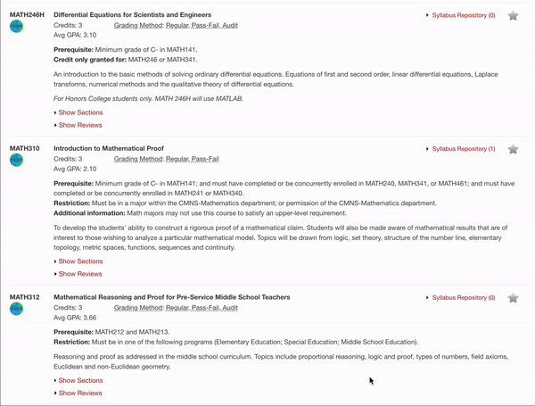

# Testudo++
A streamlined process for reviewing course details and professor evaluations integrated as a browser extension on https://app.testudo.umd.edu/soc/ using the [PlanetTerp](https://planetterp.com/api/) API.

## Table of Contents
- [Preview](#Preview)
- [Features](#Features)
- [Skills/Technologies](#Skills/Technologies)
- [Status](#Status)
- [Contribute!](#Contribute!)
- [Meta](#Meta)
- [Reflection](#Reflection)

## Preview

## Features
- Displays average course GPA
- Course link navigates you to the corresponding PlanetTerp course website
- Professor links
    - PlanetTerp link navigates you to the corresponding PlanetTerp professor page
    - RateMyProfessor link navigates you to the corresponding RateMyProfessor professor page
- Professor ratings show the average student ratings given to that professor
    - Intuitive matching color gradient to indicate positive/negative scale (red, yellow, green)
- Scrollable professor reviews window
    - Able to filter by professor
        - Organized by active/inactive instructor status
        - View by grouping
        - Sorted alphabetically 
    - Able to sort by 'Most Recent', 'Most Critical', and 'Most Favorable'
    - Additional information popup window

## Skills/Technologies
- Javascript, HTML, CSS
- Asynchronous Handling
- Cross-Origin Resource Sharing (CORS) compliance, limitations, & significance
- Service Workers
- Mutation Observer API
- AJAX Fetch API
- [Chrome Extension API](https://developer.chrome.com/docs/extensions/reference/api)
- [PlanetTerp API](https://planetterp.com/api/)

## Status
Just finished the initial release (1.0.0).  I might take a break from this for a bit since the base feature set is developed enough, but there is still more that could be added/fixed.
### Future Implementations
- Display the total student count next to the 'Avg GPA'
    - This would help provide extra context to the 'Avg GPA' value by showing the sample size
    - It should be relatively easily to implement given the PT API grades request, although it would be a bit time-consuming
    - Worried about minimizing API calls since course-page lists can extend pretty long (avoid rate limiting)
- Make reviews window size manually readjustable  
    - Corner tab to vertically-drag and expand/shrink container
- Design functional extension icon popup window
    - Can manually toggle links, reviews, layout, etc. for customization
- Significantly refactor codebase
    - I definitely know that large improvements could be made in the way it's coded and organized
- Fix random instances of "Extension context invalidated" Error Message
    - "Extension is unloaded, the existing content scripts lose their connection to the rest of the extension—i.e. ports close, and they would be unable to use runtime.sendMessage()—but the content scripts themselves still continue to work, as they're already injected into their pages... Problems can arise if either: (1) your original content script is still trying to communicate with the rest of the extension or (2) your original content script does things like modify the DOM, as you could end up with those changes done more than once."
    - An informative thread: https://stackoverflow.com/questions/53939205/how-to-avoid-extension-context-invalidated-errors-when-messaging-after-an-exte
- Potentially integrate with some other public testudo extensions
    - Schedule Importer, etc.
- Migrate extension to support other browsers (Safari, firefox, etc.)
- Add support for different screen dimensions (mobile phone & tablet)
- *Find way to alleviate maintainence hour access
    - Just an idea: Fetch local copies of transcript, schedule, etc., and use [chrome.storage](https://developer.chrome.com/docs/extensions/reference/api/storage) as "snapshots" since last updated

## Contribute!
Pull requests are the best way to propose changes to the codebase. I actively welcome your pull requests:

1. Fork the repo and create your own feature branch from master.
2. Commit your code changes.
3. Push to your feature branch.
6. Issue a pull request!

Distributed under the MIT license. See ``LICENSE`` for more information.

## Meta
Timeline: (December 20th, 2023 - February 1st, 2024)  
Made by Joshua Nguyen: 3rd Year Undergraduate @UMD
- [LinkedIn](https://www.linkedin.com/in/joshua-nguyen-666837241/)
- nguyen.trong.joshua@gmail.com

## Reflection
This entire project was a rollercoaster. I had this idea during a trip in Vietnam over winter break, and I began to officially work on it when I returned to the States.  ...
### Challenges
### New Things Learned
